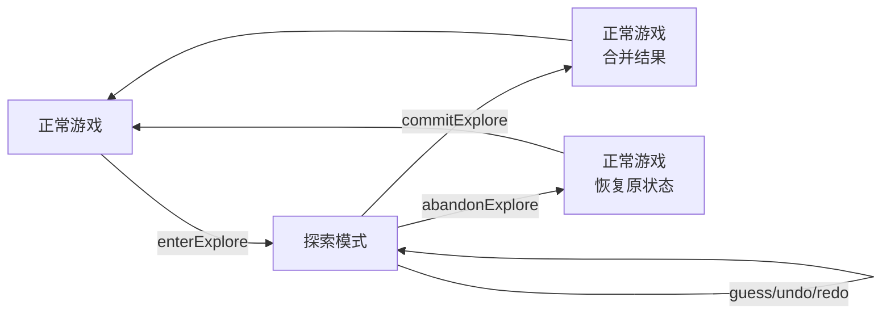
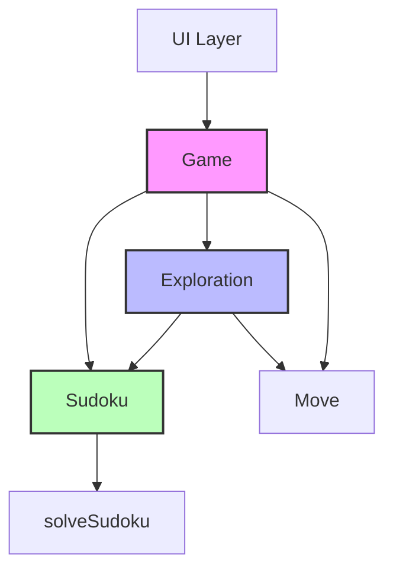

## 产品概述

在Homework 1已有的Sudoku/Game对象模型基础上，增加提示（Hint）和探索（Explore）两个功能，同时保持对象模型整体一致，通过文档说明新增功能如何影响设计。

## 核心功能

### A. 提示功能（Hint）

根据用户明确要求，提示功能分为两种实现方式：

1. **候选提示（规则法）**

- 功能：提示用户当前棋盘某个格子的候选数集合
- 实现：通过排除行/列/宫已有数字计算候选数
- 输入：行列坐标(row, col)，范围[0-8]
- 输出：Set，包含1-9中所有可能的候选数

2. **答案提示（求解器法）**

- 功能：直接得到指定格子的正确答案
- 实现：通过调用已有的solveSudoku()函数（来自src/node_modules/@sudoku/sudoku.js，内部使用@mattflow/sudoku-solver）
- 输入：行列坐标(row, col)，范围[0-8]
- 输出：number，该位置的正确答案（1-9）

### B. 探索功能（Explore）

1. **进入探索**：从当前主局面创建独立探索会话
2. **探索内操作**：在探索会话中进行填数、撤销、重做
3. **提交探索**：将探索结果合并到主局面
4. **放弃探索**：丢弃探索会话，恢复到探索前的主局面
5. **冲突检测**：在探索过程中检测数独规则冲突
6. **失败路径记忆**：记录探索失败的棋盘状态，避免重复探索

## 设计要求

- 提示功能必须通过领域对象接口提供，而非仅在UI组件中临时拼接
- 需要说明提示能力属于Sudoku还是Game，或者两者如何协作
- 探索模式能够判断冲突、回溯、记忆失败路径
- 主局面与探索局面的关系需要明确说明
- history结构需要说明如何演进
- 保持Homework 1中已有的Undo/Redo不失效
- 不允许仅通过UI层临时变量伪造探索模式
- 提示与探索必须体现在对象设计中

## 技术栈选择

### 现有技术栈（基于现有项目）

- **前端框架**：Svelte 3.59.2
- **样式**：Tailwind CSS 2.2.19
- **构建工具**：Rollup
- **测试框架**：Vitest 1.4.0
- **数独求解器**：@mattflow/sudoku-solver 2.2.0（用于答案提示）
- **数独生成器**：fake-sudoku-puzzle-generator 1.2.1

### 技术选型决策

- 继续使用现有项目的技术栈，保持一致性
- 提示功能：候选提示用规则法（在Sudoku.js中实现），答案提示复用已有的solveSudoku()函数
- 探索模式：新增Exploration类，采用"Game创建临时子会话"方案

## 实现方案

### 1. 提示功能实现

#### 候选提示（规则法）- Sudoku.js新增getCandidates(row, col)方法

**功能**：获取指定位置所有可能的候选值

**实现逻辑**：

1. 验证坐标范围：[0-8, 0-8]
2. 如果指定位置已有值（非0），返回空Set
3. 收集同一行已有的数字（排除0）
4. 收集同一列已有的数字（排除0）
5. 收集同一宫（3x3盒）已有的数字（排除0）
6. 从1-9中排除以上所有数字，得到候选数集合
7. 返回Set

**性能分析**：

- 时间复杂度：O(27)，常数时间
- 空间复杂度：O(9)，可忽略
- 无需优化

#### 答案提示（求解器法）- Sudoku.js新增getAnswer(row, col)方法

**功能**：获取指定位置的正确答案

**实现逻辑**：

1. 导入solveSudoku()函数（来自src/node_modules/@sudoku/sudoku.js）
2. 调用solveSudoku(this.getGrid())获取完整解集
3. 返回指定位置(row, col)的答案

**性能优化**：

- 在Sudoku实例中新增_solutionCache属性
- 第一次调用getAnswer()时，求解并缓存结果
- 后续调用直接返回缓存结果
- 当棋盘状态改变时（guess()被调用），清空缓存

#### 提示功能归属决策

**候选数计算和答案获取**：属于Sudoku

- 原因：都是棋盘级别的操作，只依赖当前棋盘状态
- Sudoku已有getGrid()、hasConflict()等方法，getCandidates()和getAnswer()与之同类

**提示触发和呈现**：由Game协调

- Game可以新增getHint(type, row, col)方法，内部调用Sudoku的对应方法
- Game负责管理游戏会话状态

### 2. 探索模式实现

#### 设计方案选择

选择**Game创建临时子会话**方案：

- Game进入探索状态时，创建Exploration对象
- Exploration持有独立的Sudoku实例和History栈
- 探索结束后，要么提交（合并到主局面），要么放弃（丢弃）
- 此方案符合作业要求中的思路，且实现清晰

#### 新增Exploration.js（探索会话对象）

**关键属性**：

- _parentSudoku：父局面（进入探索时的主局面快照）
- _currentSudoku：当前探索局面（Sudoku实例，可修改）
- _undoStack：探索内撤销栈（存储Sudoku快照）
- _redoStack：探索内重做栈
- _failedStates：失败路径集合（Set，存储棋盘状态哈希）

**关键方法**：

- constructor(sudoku)：构造函数，接收父局面Sudoku对象
- guess(move)：执行一步操作，推入撤销栈
- undo()：撤销一步操作
- redo()：重做一步操作
- commit()：提交探索，返回最终局面的Sudoku实例
- abandon()：放弃探索，返回父局面的Sudoku实例
- hasConflict()：检查当前局面是否有冲突
- isFailedState()：检查当前状态是否已在失败路径中
- markFailed()：标记当前状态为失败

**失败路径记忆实现**：

- 哈希方法：grid.map(row => row.join('')).join('')
- 每次探索导致冲突时，调用markFailed()
- 执行操作前，可调用isFailedState()检查

#### Game.js修改

**新增属性**：

- _exploration：当前探索会话（null表示不在探索中）

**新增方法**：

- enterExplore()：进入探索模式，创建Exploration对象
- commitExplore()：提交探索，将结果合并到主局面
- abandonExplore()：放弃探索，丢弃Exploration
- isExploring()：检查是否正在探索中

**修改现有方法**：

- guess(move)：如果在探索中，路由到_exploration.guess(move)
- undo()：如果在探索中，路由到_exploration.undo()
- redo()：如果在探索中，路由到_exploration.redo()
- getSudoku()：如果在探索中，返回_exploration._currentSudoku的拷贝

### 3. 状态流转设计



### 4. 冲突检测与失败记忆

#### 冲突检测

- 复用Sudoku.js已有的hasConflict(row, col, value)方法
- 复用Sudoku.js已有的getConflicts()方法
- Exploration可在guess()后自动检查冲突

#### 失败路径记忆

- 使用Set存储失败状态哈希
- 哈希计算：O(81) = O(1)
- 查找失败状态：O(1)
- 当探索导致冲突时，记录当前状态
- 进入探索时或执行操作前，检查当前状态是否已失败过

### 5. History演进

#### 主History

- 保持线性Undo/Redo栈不变
- 提交探索时，将最终局面作为新状态推入主history

#### 探索History

- Exploration内部维护独立的Undo/Redo栈
- 探索内的操作不直接推入主history
- 提交时，只将最终结果推入主history

#### 提交时的主历史处理

- 进入探索时，不推入主history
- 提交探索时，将进入探索前的局面推入undoStack
- 将最终局面设置为当前Sudoku
- 这样Undo时可以回到探索前的状态

## 实现注意事项

### 性能考虑

- 候选数计算是轻量级操作，无需缓存
- 答案提示调用求解器，可考虑缓存求解结果
- 失败路径记忆使用哈希集合，查找效率高

### 影响范围控制

- 保持向后兼容：Homework 1的Undo/Redo不应因本次改动而失效
- 避免无关重构：只修改必要的文件和代码
- 使用安全回退：探索模式失败时不应影响主局面

## 架构设计

### 系统架构



### 模块划分

#### 领域层（src/domain/）

- **Sudoku.js**：核心棋盘对象，新增提示相关方法
- **Game.js**：游戏会话管理，新增探索模式状态管理
- **Exploration.js**：探索会话对象（新增）
- **Move.js**：操作命令值对象（不变）

#### 测试层（tests/hw2/）

- 提示功能测试
- 探索模式测试

#### 文档层

- **EVOLUTION.md**：设计演进文档（新增）

## 目录结构

```
project-root/
├── src/
│   └── domain/
│       ├── Sudoku.js        # [MODIFY] 新增getCandidates(), getAnswer()方法
│       ├── Game.js          # [MODIFY] 新增探索模式状态管理
│       ├── Exploration.js   # [NEW] 探索会话对象
│       └── index.js         # [MODIFY] 导出Exploration
├── tests/
│   └── hw2/                # [NEW] Homework 2测试目录
│       ├── 01-hint.test.js
│       ├── 02-explore-basic.test.js
│       └── 03-explore-commit-abandon.test.js
└── EVOLUTION.md            # [NEW] 设计演进文档
```

### 文件详细说明

#### src/domain/Sudoku.js [MODIFY]

- **用途**：核心棋盘领域对象
- **功能**：新增提示相关方法
- **实现要求**：
- 实现getCandidates(row, col)方法，使用规则法计算候选数
- 实现getAnswer(row, col)方法，调用solveSudoku()获取答案
- 新增_solutionCache属性，缓存求解结果
- 在guess(move)方法中，清空_solutionCache
- 保持现有方法不变

#### src/domain/Game.js [MODIFY]

- **用途**：游戏会话管理
- **功能**：新增探索模式状态管理
- **实现要求**：
- 新增_exploration属性
- 实现enterExplore()、commitExplore()、abandonExplore()、isExploring()方法
- 修改guess()、undo()、redo()方法，在探索中时路由到Exploration

#### src/domain/Exploration.js [NEW]

- **用途**：探索会话对象
- **功能**：管理探索模式的独立状态和历史
- **实现要求**：
- 实现构造函数和所有关键方法
- 维护_failedStates集合，记录失败路径
- 在guess()后自动检查冲突

#### src/domain/index.js [MODIFY]

- **用途**：领域层模块导出
- **功能**：导出新增的Exploration类

#### tests/hw2/ [NEW]

- **用途**：Homework 2测试
- **功能**：测试提示功能和探索模式

#### EVOLUTION.md [NEW]

- **用途**：设计演进文档
- **功能**：回答作业要求的设计问题