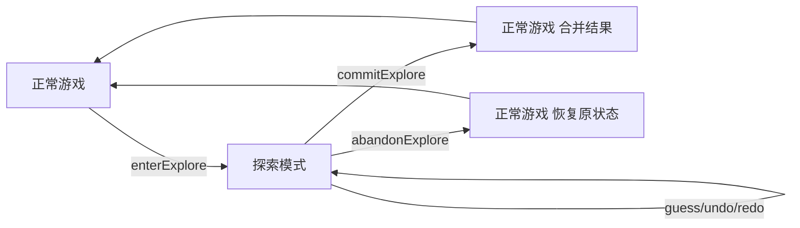
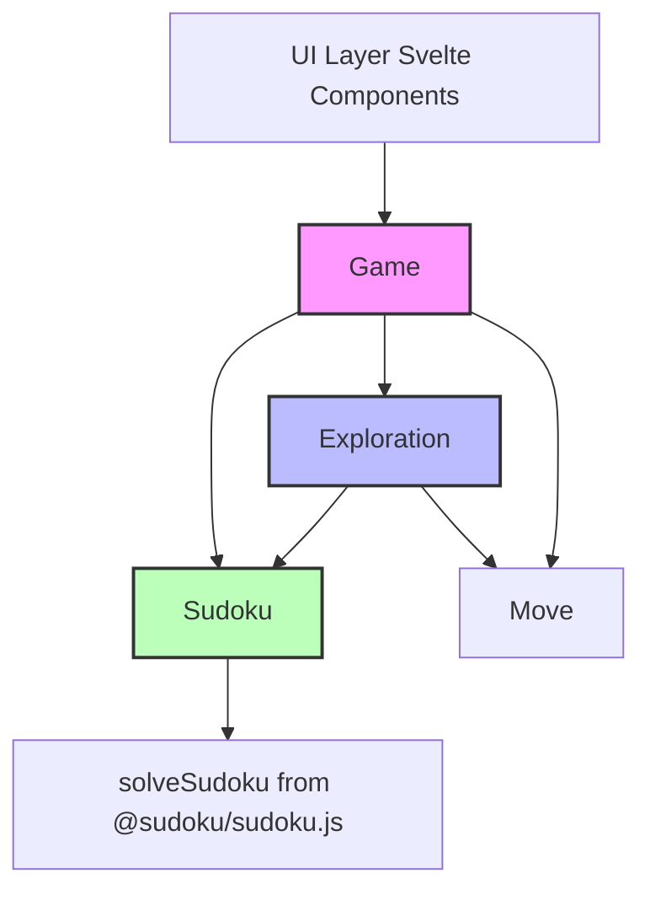

## 产品概述

在 Homework 1 已有的 Sudoku/Game 对象模型基础上，增加提示（Hint）和探索（Explore）两个功能，通过 EVOLUTION.md 文档说明新增功能如何影响设计。

## 核心功能

### A. 提示功能（Hint）

提示功能分为两种实现方式：

1. **候选提示（规则法）**

- 提示用户当前棋盘某个格子的候选数集合
- 实现方式：复用 `hasConflict(row, col, value)` 方法，遍历数字 1-9，每个数字调用 `hasConflict()`，无冲突的数字加入候选数集合
- 输入：行列坐标 (row, col)，范围 [0-8]
- 输出：Set，包含 1-9 中所有可能的候选数

2. **答案提示（求解器法）**

- 直接得到指定格子的正确答案
- 实现方式：调用 `solveSudoku()` 函数（来自 `src/node_modules/@sudoku/sudoku.js`，内部使用 `@mattflow/sudoku-solver`）
- 优化：新增 `_solutionCache` 属性缓存求解结果，调用 `guess()` 时清空缓存
- 输入：行列坐标 (row, col)，范围 [0-8]
- 输出：number，该位置的正确答案（1-9）

### B. 探索功能（Explore）

1. **进入探索**：从当前主局面创建独立探索会话
2. **探索内操作**：在探索会话中进行填数、撤销、重做
3. **提交探索**：将探索结果合并到主局面
4. **放弃探索**：丢弃探索会话，恢复到探索前的主局面
5. **冲突检测**：在探索过程中检测数独规则冲突
6. **失败路径记忆**：记录探索失败的棋盘状态，避免重复探索

## 设计要求

- 提示功能必须通过领域对象接口提供，而非仅在 UI 组件中临时拼接
- 探索模式能够判断冲突、回溯、记忆失败路径
- 主局面与探索局面的关系需要明确说明
- history 结构需要说明如何演进
- 保持 Homework 1 中已有的 Undo/Redo 不失效
- 不允许仅通过 UI 层临时变量伪造探索模式
- 提示与探索必须体现在对象设计中

## 技术栈选择

### 现有技术栈（基于现有项目）

- **前端框架**：Svelte 3.59.2
- **样式**：Tailwind CSS 2.2.19
- **构建工具**：Rollup
- **测试框架**：Vitest 1.4.0
- **数独求解器**：@mattflow/sudoku-solver 2.2.0（用于答案提示）
- **数独生成器**：fake-sudoku-puzzle-generator 1.2.1

### 技术选型决策

- 继续使用现有项目的技术栈，保持一致性
- 候选提示用规则法（在 Sudoku.js 中实现，复用 `hasConflict()` 方法）
- 答案提示复用已有的 `solveSudoku()` 函数（位于 `src/node_modules/@sudoku/sudoku.js`）
- 探索模式：新增 `Exploration` 类，采用 Game 创建临时子会话方案

## 实现方案

### 1. 提示功能实现

#### 候选提示（规则法）— Sudoku.js 新增 `getCandidates(row, col)` 方法

**功能**：获取指定位置所有可能的候选值（规则法）

**实现逻辑**（按用户指定方式）：

1. 调用已有 `_validateCoord(row, col)` 验证坐标范围
2. 如果指定位置已有值（非 0），返回空 Set
3. 遍历数字 1-9，对每个数字调用 `hasConflict(row, col, value)`
4. 无冲突的数字加入候选数集合
5. 返回 Set<number>

**代码示例**：

```javascript
getCandidates(row, col) {
  this._validateCoord(row, col);
  if (this._grid[row][col] !== 0) {
    return new Set();
  }
  const candidates = new Set();
  for (let value = 1; value <= 9; value++) {
    if (!this.hasConflict(row, col, value)) {
      candidates.add(value);
    }
  }
  return candidates;
}
```

**性能分析**：

- 时间复杂度：O(9×27) = O(1)，常数时间
- 空间复杂度：O(9)，可忽略
- 无需缓存

#### 答案提示（求解器法）— Sudoku.js 新增 `getAnswer(row, col)` 方法

**功能**：获取指定位置的正确答案（通过求解器）

**实现逻辑**：

1. 在 Sudoku 实例中新增 `_solutionCache` 属性（初始为 null）
2. 第一次调用时：将当前 grid 传入 `solveSudoku()` 获取完整解集，缓存结果
3. 后续调用直接返回缓存结果中指定位置的值
4. 当棋盘状态改变时（`guess()` 被调用），清空 `_solutionCache`

**性能优化**：

- 求解器调用开销较大，通过缓存避免重复求解
- 只在棋盘状态变化时失效缓存

#### 提示功能归属决策

- **候选数计算和答案获取**：属于 `Sudoku`
- 原因：都是棋盘级别的操作，只依赖当前棋盘状态
- Sudoku 已有 `getGrid()`、`hasConflict()` 等方法，`getCandidates()` 和 `getAnswer()` 与之同类
- **提示触发和呈现**：由 `Game` 协调（可选）
- Game 可以新增 `getHint(type, row, col)` 方法，内部调用 Sudoku 的对应方法
- Game 负责管理游戏会话状态

### 2. 探索模式实现

#### 设计方案选择

选择 **Game 创建临时子会话** 方案：

- Game 进入探索状态时，创建 Exploration 对象
- Exploration 持有独立的 Sudoku 实例和 History 栈
- 探索结束后，要么提交（合并到主局面），要么放弃（丢弃）
- 此方案符合作业要求中的思路，且实现清晰

#### 新增 Exploration.js（探索会话对象）

**文件用途**：探索会话领域对象，管理探索模式的独立状态和分支历史

**关键属性**：

- `_parentSudoku`：父局面（进入探索时的主局面快照，Sudoku 实例）
- `_currentSudoku`：当前探索局面（Sudoku 实例，可修改）
- `_undoStack`：探索内撤销栈（存储 Sudoku 快照）
- `_redoStack`：探索内重做栈
- `_failedStates`：失败路径集合（Set，存储棋盘状态哈希字符串）

**关键方法**：

- `constructor(sudoku)`：构造函数，接收父局面 Sudoku 对象，深拷贝后作为当前探索局面
- `guess(move)`：执行一步操作，先保存快照到 undoStack，再调用 `_currentSudoku.guess(move)`，清空 redoStack
- `undo()`：从 undoStack 弹出快照恢复，当前状态压入 redoStack
- `redo()`：从 redoStack 弹出快照恢复，当前状态压入 undoStack
- `commit()`：提交探索，返回最终局面的 Sudoku 实例（深拷贝）
- `abandon()`：放弃探索，返回父局面的 Sudoku 实例（深拷贝）
- `hasConflict()`：检查当前局面是否有冲突（调用 `_currentSudoku.getConflicts()`）
- `isFailedState()`：检查当前状态是否已在失败路径中（比对哈希）
- `markFailed()`：标记当前状态为失败（将哈希加入 `_failedStates`）

**失败路径记忆实现**：

- 哈希方法：`_currentSudoku.getGrid().map(row => row.join('')).join('')`
- 每次探索导致冲突时，调用 `markFailed()`
- 执行操作前，可调用 `isFailedState()` 检查

#### Game.js 修改

**新增属性**：

- `_exploration`：当前探索会话（null 表示不在探索中）

**新增方法**：

- `enterExplore()`：进入探索模式，创建 Exploration 对象，返回 boolean 表示成功与否
- `commitExplore()`：提交探索，将 Exploration 的最终局面替换当前 Sudoku，将进入探索前的局面推入主 undoStack，清空 Exploration，返回 boolean
- `abandonExplore()`：放弃探索，丢弃 Exploration（_exploration 置 null），无返回值
- `isExploring()`：检查是否正在探索中，返回 boolean

**修改现有方法**：

- `guess(move)`：如果在探索中，路由到 `_exploration.guess(move)`
- `undo()`：如果在探索中，路由到 `_exploration.undo()`
- `redo()`：如果在探索中，路由到 `_exploration.redo()`
- `getSudoku()`：如果在探索中，返回 `_exploration._currentSudoku` 的拷贝（调用 `clone()`）

### 3. 状态流转设计



### 4. 冲突检测与失败记忆

#### 冲突检测

- 复用 Sudoku.js 已有的 `hasConflict(row, col, value)` 方法（检查指定位置放置值是否冲突）
- 复用 Sudoku.js 已有的 `getConflicts()` 方法（获取所有冲突单元格坐标）
- Exploration 可在 `guess()` 后自动检查冲突，若冲突可自动调用 `markFailed()`

#### 失败路径记忆

- 使用 Set 存储失败状态哈希
- 哈希计算：O(81) = O(1)（常数时间）
- 查找失败状态：O(1)
- 当探索导致冲突时，记录当前状态
- 进入探索时或执行操作前，检查当前状态是否已失败过

### 5. History 演进

#### 主 History

- 保持线性 Undo/Redo 栈不变
- 提交探索时，将最终局面作为新状态推入主 history

#### 探索 History

- Exploration 内部维护独立的 Undo/Redo 栈
- 探索内的操作不直接推入主 history
- 提交时，只将最终结果推入主 history

#### 提交时的主历史处理

- 进入探索时，不推入主 history（避免额外快照）
- 提交探索时，先将进入探索前的局面推入 undoStack（通过保存的父局面）
- 再将最终局面设置为当前 Sudoku
- 这样 Undo 时可以回到探索前的状态

## 实现注意事项

### 性能考虑

- 候选数计算是轻量级操作（O(1)），无需缓存
- 答案提示调用求解器，通过 `_solutionCache` 缓存求解结果，避免重复求解
- 失败路径记忆使用哈希集合（Set），查找效率 O(1)
- Exploration 的 undo/redo 使用深拷贝快照，空间换简洁性

### 影响范围控制

- **保持向后兼容**：Homework 1 的 Undo/Redo 不应因本次改动而失效
- 正常游戏状态下的 guess/undo/redo 行为完全不变
- 只有探索中才路由到 Exploration
- **避免无关重构**：只修改必要的文件和代码
- 不修改 Move.js
- 不修改 Sudoku.js 的现有方法（只新增）
- **使用安全回退**：探索模式失败时不应影响主局面
- abandonExplore() 完全丢弃 Exploration
- 主 history 在探索期间不被修改

### 不可复用的代码说明

以下 UI 层代码**不能复用**，需要在领域层重新实现：

- `src/node_modules/@sudoku/stores/candidates.js`：UI 层 Svelte store，管理用户手动笔记的候选数，不包含自动计算逻辑
- `src/node_modules/@sudoku/stores/hints.js`：UI 层 Svelte store，管理提示次数限制，不是提示逻辑本身
- `src/components/Board/Candidates.svelte`：UI 显示组件，负责渲染候选数，不包含计算逻辑

## 架构设计

### 系统架构



### 模块划分

#### 领域层（src/domain/）

- **Sudoku.js**：核心棋盘对象，新增提示相关方法（getCandidates、getAnswer、_solutionCache）
- **Game.js**：游戏会话管理，新增探索模式状态管理
- **Exploration.js**：探索会话对象（新增）
- **Move.js**：操作命令值对象（不变）

#### 测试层（tests/hw2/）

- 提示功能测试（候选提示 + 答案提示）
- 探索模式测试（进入/提交/放弃、冲突检测、失败路径记忆）

#### 文档层

- **EVOLUTION.md**：设计演进文档（新增），回答作业要求的所有设计问题

## 目录结构

```
project-root/
├── src/
│   └── domain/
│       ├── Sudoku.js        # [MODIFY] 新增 getCandidates(), getAnswer() 方法，新增 _solutionCache 属性
│       ├── Game.js          # [MODIFY] 新增探索模式状态管理（_exploration, enterExplore, commitExplore, abandonExplore, isExploring）
│       ├── Exploration.js   # [NEW] 探索会话对象，管理独立状态和分支历史
│       └── index.js         # [MODIFY] 导出 Exploration 类
├── tests/
│   ├── hw1/                # [EXISTING] Homework 1 测试（不变）
│   └── hw2/                # [NEW] Homework 2 测试目录
│       ├── 01-hint.test.js           # 提示功能测试（候选提示 + 答案提示）
│       ├── 02-explore-basic.test.js  # 探索模式基础测试（进入/退出）
│       └── 03-explore-commit-abandon.test.js  # 探索提交/放弃测试
└── EVOLUTION.md            # [NEW] 设计演进文档（回答作业要求的所有设计问题）
```

### 文件详细说明

#### src/domain/Sudoku.js [MODIFY]

- **用途**：核心棋盘领域对象
- **功能**：新增提示相关方法
- **实现要求**：
- 新增 `_solutionCache` 属性（初始 null），用于缓存求解器结果
- 实现 `getCandidates(row, col)` 方法，复用 `hasConflict()` 计算候选数集合
- 实现 `getAnswer(row, col)` 方法，调用 `solveSudoku()` 获取答案（带缓存）
- 在现有 `guess(move)` 方法中，清空 `_solutionCache`（棋盘状态已改变）
- 保持现有方法不变（getGrid, getFixed, isFixedAt, getValue, canApply, hasConflict, getConflicts, isSolved, clone, toJSON, fromJSON 等）

#### src/domain/Game.js [MODIFY]

- **用途**：游戏会话管理
- **功能**：新增探索模式状态管理
- **实现要求**：
- 新增 `_exploration` 属性（初始 null）
- 实现 `enterExplore()` 方法：创建 Exploration 对象赋值给 `_exploration`
- 实现 `commitExplore()` 方法：提交探索结果到主局面
- 实现 `abandonExplore()` 方法：丢弃 Exploration
- 实现 `isExploring()` 方法：返回是否正在探索中
- 修改 `guess(move)` 方法：如果在探索中，路由到 `_exploration.guess(move)`
- 修改 `undo()` 方法：如果在探索中，路由到 `_exploration.undo()`
- 修改 `redo()` 方法：如果在探索中，路由到 `_exploration.redo()`
- 修改 `getSudoku()` 方法：如果在探索中，返回 `_exploration._currentSudoku.clone()`

#### src/domain/Exploration.js [NEW]

- **用途**：探索会话对象
- **功能**：管理探索模式的独立状态、分支历史和失败路径记忆
- **实现要求**：
- 实现构造函数 `constructor(sudoku)`，接收父局面 Sudoku 对象
- 实现 `guess(move)`、`undo()`、`redo()` 方法
- 实现 `commit()` 方法：返回最终局面的 Sudoku 实例（深拷贝）
- 实现 `abandon()` 方法：返回父局面的 Sudoku 实例（深拷贝）
- 实现 `hasConflict()` 方法：检查当前局面是否有冲突
- 实现 `isFailedState()` 方法：检查当前状态是否已在失败路径中
- 实现 `markFailed()` 方法：标记当前状态为失败
- 维护 `_failedStates` 集合，记录失败路径

#### src/domain/index.js [MODIFY]

- **用途**：领域层模块导出
- **功能**：导出新增的 Exploration 类
- **实现要求**：
- 在现有导出基础上，新增 `export { Exploration } from './Exploration.js';`

#### tests/hw2/ [NEW]

- **用途**：Homework 2 测试
- **功能**：测试提示功能和探索模式
- **实现要求**：
- `01-hint.test.js`：测试 `getCandidates()` 和 `getAnswer()` 方法
- `02-explore-basic.test.js`：测试进入探索、探索内操作
- `03-explore-commit-abandon.test.js`：测试提交探索、放弃探索、冲突检测、失败路径记忆

#### EVOLUTION.md [NEW]

- **用途**：设计演进文档
- **功能**：回答作业要求的所有设计问题
- **实现要求**：
- 回答：如何实现提示功能？
- 回答：提示功能更属于 Sudoku 还是 Game？为什么？
- 回答：如何实现探索模式？
- 回答：主局面与探索局面的关系是什么？
- 回答：history 结构在本次作业中是否发生了变化？
- 回答：Homework 1 中的哪些设计，在 Homework 2 中暴露出了局限？
- 回答：如果重做一次 Homework 1，你会如何修改原设计？